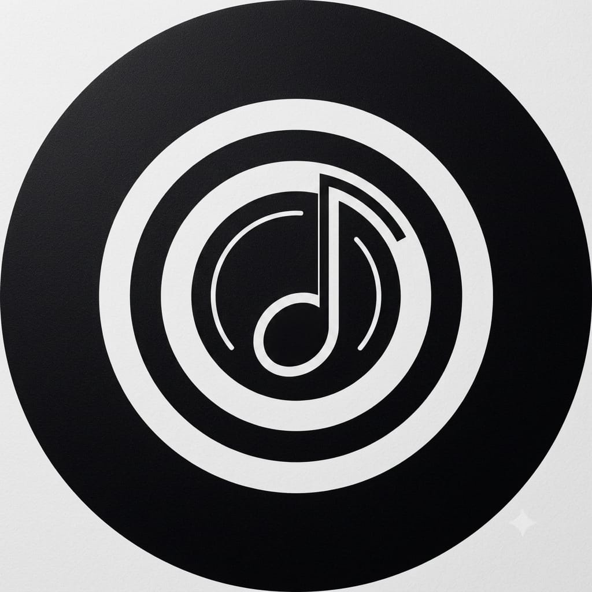

<div align="center">

# WAVE

### Modern Music Discovery & Streaming Experience

**Discover music. Search instantly. Listen seamlessly.**

[](https://react.dev/)
[](https://www.typescriptlang.org/)
[](https://vite.dev/)
[](https://expressjs.com/)

<br>



<br>

*A futuristic, responsive music web application built for fast discovery and immersive playback.*

</div>

---

## About

**WAVE** is a modern music discovery and streaming web application focused on making music search, discovery and playback fast, interactive and visually engaging.

The project uses a React and TypeScript frontend together with an Express backend. It combines music metadata, artwork, playback resolution, lyrics, recommendations, listening history and an interactive audio visualizer into one unified experience.

The interface is built around a dark, futuristic visual language with glass-inspired surfaces, animated controls and responsive layouts for desktop and mobile devices.

---

## Features

### Music Discovery

- Live music search while typing
- Debounced search requests
- Trending and curated music sections
- Regional charts and artist discovery
- Track recommendations
- Artist information
- Rich track metadata
- Artwork resolution with fallbacks

### Playback

- Integrated music player
- Play and pause controls
- Previous and next track controls
- Queue management
- Autoplay queue
- Shuffle
- Repeat
- Playback progress
- Deep-linking to individual tracks
- YouTube-based playback resolution

### Lyrics

- Lyrics lookup
- Plain lyrics support
- Synchronized LRC lyrics when available
- Dedicated lyrics interface

### Audio Visualization

WAVE includes an interactive audio visualizer with multiple modes:

- Equalizer
- Cosmic Ring
- Waveform
- Aura

The visualizer uses the browser Canvas API and responds to the currently playing audio.

### Personalization

- Favorites
- Listening history
- Local browser persistence
- Listening memory
- User/profile state
- Queue state

### User Experience

- Responsive desktop and mobile layouts
- Keyboard shortcuts
- Toast notifications
- Artist modal
- Lyrics modal
- Queue drawer
- Authentication modal
- Responsive artwork
- Fast search feedback
- Custom WAVE branding

---

## Architecture

```text
                         WAVE APPLICATION
                                |
              +-----------------+-----------------+
              |                                   |
              v                                   v
      React + TypeScript                    Express Server
              |                                   |
              |                            /api/* routes
              |                                   |
              +-----------------+-----------------+
                                |
          +---------------------+---------------------+
          |                     |                     |
          v                     v                     v
      Last.fm               YouTube              Lyrics APIs
   Music Metadata         Playback Data          Lyrics Data
          |
          v
      iTunes API
   Artwork Fallback
```

### Search Flow

```text
User enters query
       |
       v
Debounced search
       |
       v
Frontend API request
       |
       v
Express backend
       |
       v
Last.fm search
       |
       v
Artwork resolution
       |
       v
Search results
       |
       v
WAVE result cards
```

### Playback Flow

```text
User selects a track
        |
        v
Track metadata prepared
        |
        v
YouTube video resolution
        |
        v
Audio player
        |
        +------> Queue
        |
        +------> Listening history
        |
        +------> Recommendations
        |
        +------> Audio visualizer
```

---

## Technology Stack

### Frontend

| Technology | Purpose |
|---|---|
| React 19 | User interface |
| TypeScript | Type-safe application development |
| Vite 6 | Frontend tooling and development server |
| Tailwind CSS | Styling |
| Motion | UI animation |
| Lucide React | Interface icons |

### Backend

| Technology | Purpose |
|---|---|
| Node.js | Server runtime |
| Express | API server |
| TypeScript | Type-safe backend code |
| tsx | TypeScript execution |
| esbuild | Production server bundling |

### External Services and Libraries

| Service / Library | Purpose |
|---|---|
| Last.fm | Music search, charts, metadata and recommendations |
| iTunes Search API | Artwork fallback |
| YouTube | Playback/video resolution |
| Lyrics APIs | Lyrics and synchronized lyrics |
| Google Gemini | AI-powered functionality where configured |
| React Player | Media playback support |
| yt-search | YouTube search |
| play-dl | YouTube/media utilities |
| ytdl-core | YouTube media handling |

---

## Project Structure

The repository currently uses a relatively flat source structure rather than the `src/components` directory layout used by some React projects.

```text
Wave/
│
├── App.tsx
├── ArtistModal.tsx
├── AudioVisualizer.tsx
├── AuthModal.tsx
├── BottomPlayer.tsx
├── KeyboardShortcutsModal.tsx
├── LyricsModal.tsx
├── Navbar.tsx
├── QueueDrawer.tsx
├── Sidebar.tsx
├── Toast.tsx
├── TrackArtwork.tsx
├── TrackCard.tsx
├── WaveLogo.tsx
├── YouTubeAudioPlayer.tsx
│
├── api.ts
├── audioEngine.ts
├── recommendations.ts
├── useKeyboardShortcuts.ts
├── types.ts
├── main.tsx
├── index.css
├── index.html
│
├── server.ts
├── package.json
├── package-lock.json
├── bun.lock
├── tsconfig.json
├── vite.config.ts
├── metadata.json
├── env.example
│
├── logo.svg
└── wave-logo.jpg
```

### Important Files

#### `App.tsx`

The main application component and primary UI/state orchestration layer.

#### `server.ts`

Express backend responsible for API routes and external service communication.

#### `TrackCard.tsx`

Renders individual music search and discovery results.

#### `TrackArtwork.tsx`

Handles track artwork presentation and artwork-related fallback behavior.

#### `BottomPlayer.tsx`

The primary music playback interface.

#### `AudioVisualizer.tsx`

Canvas-based real-time audio visualization.

#### `LyricsModal.tsx`

Lyrics display and synchronized lyrics interface.

#### `QueueDrawer.tsx`

Playback queue and autoplay queue management.

#### `ArtistModal.tsx`

Artist information and related media interface.

#### `WaveLogo.tsx`

Application branding component.

#### `api.ts`

Frontend API communication layer.

#### `audioEngine.ts`

Audio-related application logic.

#### `recommendations.ts`

Recommendation and discovery-related logic.

---

## Official Project Logo

The image below is the official WAVE project logo stored in the repository root as `wave-logo.jpg`.

<div align="center">


</div>

The README intentionally uses a relative root path:

```html

```

This matches the actual repository structure and allows GitHub to render the image directly from the repository.

---

## Getting Started

### Prerequisites

Install the following before running WAVE:

- Node.js
- npm
- A Last.fm API key
- A Gemini API key if Gemini-powered features are being used

Bun can also be used because the repository contains a `bun.lock` file.

---

## Installation

### 1. Clone the repository

```bash
git clone https://github.com/singhshivaofficial/Wave.git
cd Wave
```

### 2. Install dependencies

Using npm:

```bash
npm install
```

Or using Bun:

```bash
bun install
```

---

## Environment Configuration

Create a `.env` file using `env.example` as the reference.

```env
LASTFM_API_KEY="your_lastfm_api_key"
GEMINI_API_KEY="your_gemini_api_key"
APP_URL="http://localhost:3000"
```

### Environment Variables

| Variable | Required | Description |
|---|---|---|
| `LASTFM_API_KEY` | Yes | Used for Last.fm search, charts, metadata and recommendations |
| `GEMINI_API_KEY` | Depending on features | Used for Gemini AI API calls |
| `APP_URL` | Depending on deployment | Application URL used by the server for hosted/self-referential functionality |

Never commit real API keys to GitHub.

---

## Running the Project

### Development

Start the development server:

```bash
npm run dev
```

The development command executes:

```text
tsx server.ts
```

Open the application at:

```text
http://localhost:3000
```

The exact port can depend on the server configuration.

---

## Production Build

Create the production build:

```bash
npm run build
```

The build process:

1. Builds the Vite frontend.
2. Bundles `server.ts` with esbuild.
3. Produces the production server at:

```text
dist/server.cjs
```

Start the production server:

```bash
npm start
```

---

## Available Scripts

The scripts are defined in `package.json`.

| Command | Description |
|---|---|
| `npm run dev` | Starts the development server |
| `npm run build` | Builds the frontend and production server |
| `npm start` | Starts the production server |
| `npm run preview` | Previews the Vite build |
| `npm run lint` | Runs TypeScript checking |
| `npm run clean` | Removes generated build files |

---

## API Overview

The Express backend provides internal API endpoints used by the frontend.

Examples include:

```text
GET  /api/health

GET  /api/music/search
GET  /api/search/songs

GET  /api/music/youtube-id

GET  /api/songs

GET  /api/lyrics

GET  /api/artist

GET  /api/curated

GET  /api/charts/regional
GET  /api/charts/artists

GET  /api/listen-memory
POST /api/listen-memory
```

The implementation and exact parameters for these routes can be found in:

```text
server.ts
```

---

## State and Persistence

WAVE manages several categories of application state.

### Playback State

- Current track
- Playing/paused status
- Playback position
- Track duration
- Shuffle
- Repeat
- Autoplay
- Current queue
- Autoplay queue

### Discovery State

- Search results
- Curated tracks
- Trending content
- Regional charts
- Artist discovery
- Recommendations

### User State

- User/profile information
- Favorites
- Listening history
- Listening memory

### UI State

- Lyrics modal
- Artist modal
- Authentication modal
- Queue drawer
- Visualizer mode
- Keyboard shortcuts
- Toast messages

Browser `localStorage` is used for client-side persistence where appropriate, while the backend can maintain listening-memory data during runtime.

---

## Performance

The application includes several techniques to keep the interface responsive:

- Debounced live search
- Protection against stale search requests
- Artwork fallback handling
- Responsive Canvas visualizer sizing
- `ResizeObserver` support
- Local persistence
- Runtime caching where implemented
- Limited recommendation/history collections

The goal is to keep music discovery responsive even while external APIs are being queried.

---

## Responsive Design

WAVE is designed for both desktop and mobile environments.

The interface adapts:

- Navigation
- Search
- Track cards
- Player controls
- Queue interface
- Lyrics interface
- Artist information
- Audio visualizer
- Artwork sizing

The core application functionality remains available across different viewport sizes.

---

## Keyboard Shortcuts

WAVE includes a dedicated keyboard-shortcut system implemented through:

```text
useKeyboardShortcuts.ts
```

The application provides keyboard-based controls for supported playback and navigation actions.

The available shortcuts can be viewed through the application's keyboard shortcuts interface.

---

## Artwork Handling

WAVE uses multiple sources to improve artwork availability.

The general fallback approach is:

```text
Primary artwork
      |
      v
Last.fm artwork
      |
      | unavailable
      v
iTunes artwork
      |
      | unavailable
      v
Additional fallback handling
```

This helps prevent missing artwork from degrading the user experience.

---

## Third-Party Services

WAVE depends on external services for parts of its functionality.

These services may have their own:

- Terms of service
- Rate limits
- Availability requirements
- API changes
- Content policies
- Authentication requirements

External API failures should be handled gracefully by the application wherever fallback behavior is available.

---

## Security

Keep private credentials outside the repository.

Do not commit:

```text
.env
.env.local
```

or any file containing real API keys.

Use:

```text
env.example
```

as the public configuration template.

If deploying publicly, configure environment variables through the hosting provider's secret/environment-variable system.

---

## Development Guidelines

When contributing to WAVE:

1. Keep existing functionality intact.
2. Avoid unnecessary dependencies.
3. Follow the existing TypeScript structure.
4. Keep API keys out of source control.
5. Test both desktop and mobile layouts.
6. Verify playback after changes to track or player components.
7. Check search behavior after modifying API-related code.
8. Run TypeScript checking before committing.

Run:

```bash
npm run lint
```

before submitting changes.

---

## Contributing

Contributions, improvements and bug fixes are welcome.

Create a feature branch:

```bash
git checkout -b feature/your-feature
```

Make your changes and test them.

Then:

```bash
git add .
git commit -m "Add: your feature"
git push origin feature/your-feature
```

Open a pull request with:

- A clear description of the change
- The reason for the change
- Testing information
- Any required environment variables
- Screenshots for major UI changes

---

## Roadmap

Possible future improvements include:

- Persistent database-backed accounts
- Cloud-synchronized playlists
- More advanced recommendation systems
- Additional audio visualizer modes
- Improved offline support
- Enhanced playlist management
- More detailed artist pages
- Social sharing
- Additional playback settings
- Progressive Web App support
- Improved mobile experience

---

## Screenshots

Screenshots can be added to the repository later and referenced from the README.

For example:

```text
screenshots/
├── home.png
├── search.png
├── player.png
└── visualizer.png
```

Then reference them with:

```md

```

No screenshot directory is required for the current project.

---

## License

No license file is currently declared in the repository.

If the project is intended to be distributed as open source, add an appropriate `LICENSE` file and update this section accordingly.

---

## Developer

### Shiva

**Creator and Developer of WAVE**

WAVE is developed by **Shiva** with a focus on modern web technologies, music discovery and an immersive listening experience.

**Repository:**  
https://github.com/singhshivaofficial/Wave

---

<div align="center">

### WAVE

**Discover. Stream. Experience.**

Made by **Shiva**

</div>
